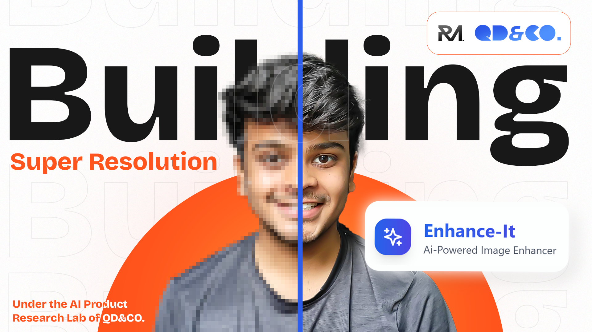

# 🚀 Enhance-It — Where AI Meets Visual Brilliance

Enhance-It isn’t just an app. It’s a **curated blend of design and artificial intelligence**, handcrafted to upscale low-resolution images into rich, crisp 4K quality — all while preserving the soul of the original.

Whether you're a designer, developer, artist, or just an enthusiast — Enhance-It gives you a window into what happens when **pixel precision meets machine intelligence**.

---

## ⚙️ Built With Love & Logic

### 🖥️ Frontend Stack

  
  
  

### 🌐 Backend Stack

  
  
  
  

### 🧠 AI & Image Processing

  
  
  
  

### 🚀 Deployment Tools

  
  

---

## 📚 Full Documentation Included

We’ve created helpful docs to make onboarding smoother than ever:

- 📘 [User Manual](https://rishimailoorkar-enhanceit-documentation.tiiny.site/)  
- 📄 [Terms & Usage Guidelines](https://www.pdfhost.net/index.php?Action=Download&File=2f7ef336c13ee2f7dc55abd8a59ecf16)

Everything from setup to how AI works under the hood is covered — no guesswork needed.

---

## 👨‍💻 Crafted by Rishi Mailoorkar

This project was envisioned and built under the **AI Research Lab of [QD&Co.](https://qdnco.com)** — a next-gen Tech × Design studio building smart tools that empower creators and communities.

> Enhance-It is part of a bigger initiative — **CREOS**, our journey to build AI-based tools through hands-on learning, public experiments, and bold ideas.

---

## ✨ Let’s Build Together

Have an idea for an AI project? Want to collaborate on something creative, technical, or futuristic?  
**Let’s talk!**

📫 Contact Me:  
- To Connect Personally : `rishi@rishofficial.com`  
- To Collabrate for our next project: `connect@qdnco.com`  
- [LinkedIn](https://www.linkedin.com/in/rishi-mailoorkar/)  
- [Behance](https://www.behance.net/rishi-mailoorkar)

---

> © 2025 Rishi Mailoorkar & QD&Co. — For educational use only. All rights reserved.
